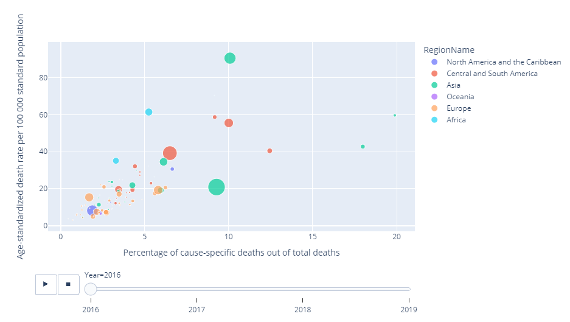

# Visulization of lower respiratory  infection deaths per country from 2016 to 2019 based on WHO data

## Data Source

Original WHO lower respiratory death data:
https://platform.who.int/mortality/themes/theme-details/topics/indicator-groups/indicator-group-details/MDB/lower-respiratory-infections

## List of Libraries

1. Pandas
2. Plotly

## Project Description 
This project demonstrates different ways to visualization lower respritory infection associated death rates per country from 2016 to 2019. 
1. Scatter Plot

2. Geographic Scatter Plot

3. Choropleth Map